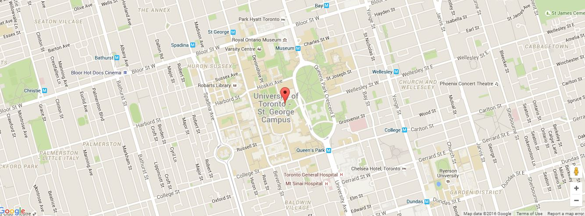

# Blank Bootstrap
For developers' foundation.

Dupe this for quick new projects :D

GitHub link is: https://github.com/nobodyrandom/blank-bootstrap.git
Inspirations: https://www.facebook.com/groups/hackathonhackers/permalink/1421368544585293/


This blank-bootstrap repository contains several self-contained modules that can be mix and matched and altered to
suit your design needs; in other words, each module provides a basic functionality for you to build upon.

Experiment with the modules and feel free to add modules of your own.

If you have any questions, or would like to show us what you've created, don't hesitate to contact:
    alex@developersfoundation.ca
    paul@developersfoundation.ca
    

## Table of Contents:

- [How-To](#how-to)
- [Google Maps](#google-maps)

## How-To:
#### Clone template and setup composer
To clone into a new repo use:

1. Create new git repo on github
2. In a clean space (not inside another git repo) `git clone https://github.com/nobodyrandom/blank-bootstrap.git projectName`
3. `cd projectName`
4. `git remote rm origin`
5. `git remote add origin https://github.com/nobodyrandom/NAME_OF_REPO.git`
6. `git push -u origin master`

(If you are really that lazy, I've included a shell script to run step 2 onwards to set up everything. Run it using `./init.sh` on terminal. No cmd support yet)


#### Deploy to Heroku
If you would like to use quick deploy into heroku after you cloned.

Update the `app.json` and click the below button.

[](https://heroku.com/deploy)

#
## Google Maps 

An Interactive Google Map with customizable features.
 

#### Instructions

Very simple usage.  Firstly, Place the provided code snippets in their respective files.

Get an API key for Google Maps from [here](https://developers.google.com/maps/documentation/javascript/)

Insert your API key below and place the following script in your footer.

`<script src="//maps.google.com/maps/api/js?key=PUT_YOUR_API_KEY_HERE&callback=loadedGmap" async defer></script>`

In the js file, specify the coordinates of the location you wish the map to be centered on.

   `var latlng = new google.maps.LatLng(-33.86455, 151.209);`


In the bottom of the js, change the $infowindow to display your location. This is what will show when you hover over the pin with your cursor. 

#### Customization

In the js file, there are many ways for you to customize the map. 

There are many map styles to pick from. To change the map style, pick a style from https://snazzymaps.com/explore.
Copy the code of your desired map style and paste it to $styleArr.

In the options, there are options to change how much you can control the map. $scrollwheel is set to false by default, meaning the scroll wheel will not zoom in or out the map, but you can activiate it if you desire.
```
 var options = {
            zoom: 15,
            center: latlng,
            mapTypeId: google.maps.MapTypeId.ROADMAP,
            navigationControl: true,
            mapTypeControl: false,
            scrollwheel: false,
            styles: styleArr,
            disableDoubleClickZoom: true
        };
        
```


