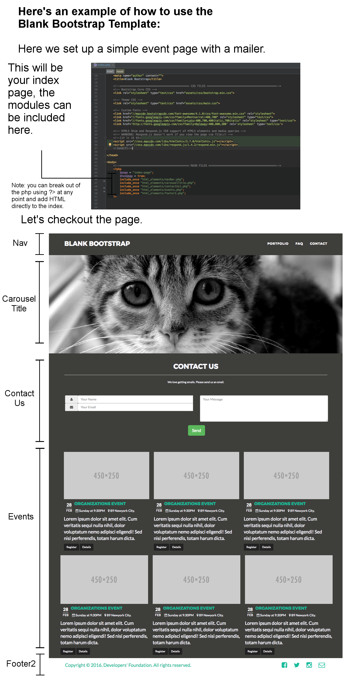

# Blank Bootstrap
Dupe this for quick new projects :D

Inspirations: https://www.facebook.com/groups/hackathonhackers/permalink/1421368544585293/
##Intro

This blank-bootstrap repository contains several self-contained modules that can be mix and matched and altered to
suit your design needs; in other words, each module provides a basic functionality for you to build upon.

Experiment with the modules and feel free to add modules of your own.

If you have any questions, or would like to show us what you've created, don't hesitate to contact:
    alex@developersfoundation.ca
    paul@developersfoundation.ca
    

## Table of Contents:

- [How-To](#how-to)
- [Photo Carousel](#carousel-three)
- [Gallery](#gallery)
- [Google Maps](#google-maps)

## How-To:
#### Clone template and setup composer
To clone into a new repo:

1. Create new git repo on github
2. In a clean space (not inside another git repo) `git clone https://github.com/nobodyrandom/blank-bootstrap.git projectName`
3. `cd projectName`
4. `git remote rm origin`
5. `git remote add origin https://github.com/nobodyrandom/NAME_OF_REPO.git`
6. `git push -u origin master`

> If you are really that lazy, I've included a shell script to run step 2 onwards to set up everything. 
It also sets up PHP and Homebrew on your Mac if you don't have it installed yet. 
Run it using `./init.sh` on terminal. No cmd support yet.

## Demo

Using the various features implemented in this template is easy. We've included a demo to demonstrate how you can use it.

Create your HTML pages as PHP files, if you've never used PHP don't worry, we will only be using a few instructions.

Set up your page as you would normally, and when you want to use a module you can insert it into the
page with:

    <?php 
        $page = "index-page";
        $hasGmap = true;
        include_once "html_elements/navBar.php";
        include_once "html_elements/carouselTitle.php";
        include_once "html_elements/events.php";
        include_once "html_elements/footer2.php";
    ?>

#### Rendered page

